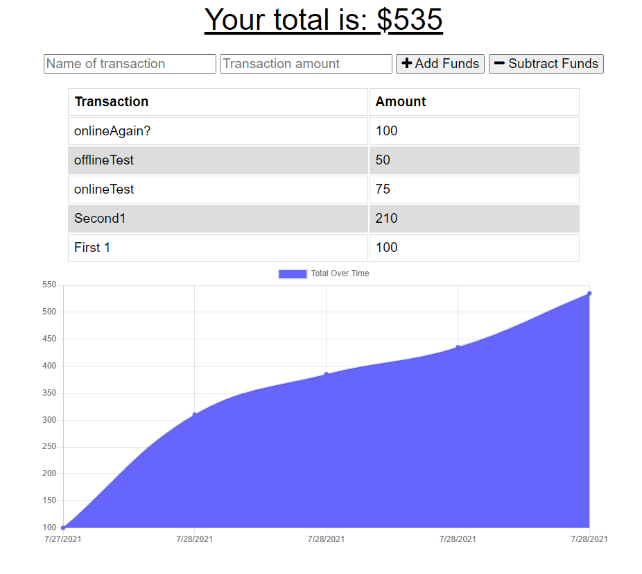

# budget_tracker

This is a basic PWA budget tracket application that enables a user to add and subtract expenses in order to manage thier total budget. This application includes a service worker that and an IndexedDB that allows a user to update thier expenses offline and have them saved automatically when the user reconnects to the network.

Here is a link to the deployed application: [Click Here](https://warm-bastion-66460.herokuapp.com/)

Here is a screenshot from the final stages of development of this application: 

